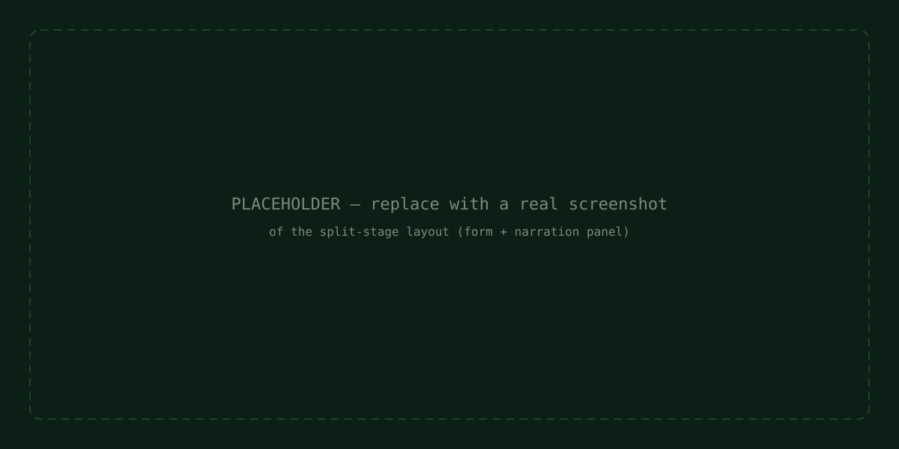

# AccessCanary

**An AI agent that catches accessibility bugs static scanners can't see.**

Built on [WebMCP](https://github.com/webmachinelearning/webmcp), AccessCanary exposes six
tools that let an AI agent observe a page's *live* state — real keyboard focus order,
whether ARIA-live regions actually announce their changes, and whether a component traps
keyboard focus — rather than guessing from a static HTML snapshot. A human tabs through a
mock government-benefits form; the agent narrates what it's finding in real time; nothing
gets logged as a confirmed violation until the human approves it.

## Why this exists

Automated accessibility scanners (axe-core, Lighthouse, WAVE) are excellent at catching
static issues — missing alt text, insufficient color contrast, missing form labels. But
independent research puts their real-world coverage at roughly 30–40% of WCAG issues. The
rest — broken tab order, silent ARIA-live regions, keyboard traps — only exist as
*behavior*: they only show up when something actually operates the page. A crawler reading
HTML cannot see them. An agent with WebMCP tools that expose live DOM state can.

## Live demo

**URL:** `[fill in your Render URL after deploying]`

**Demo video:** `[fill in your video link]`

To test it yourself, see [How to test it](#how-to-test-it) below.

## What it does

AccessCanary presents a mock benefits-application form containing three real,
deliberately-built accessibility defects — the kind that occur in production code, not
staged fakes. As a human tabs through the form, an AI agent calls WebMCP tools to inspect
the page's live state, narrates what it observes in the panel alongside the form, and
proposes findings. Each proposed finding requires explicit human confirmation before it's
logged — the agent can flag, but only a person decides what counts as a real violation.

## The six WebMCP tools

| Tool | What it does | Read-only |
|---|---|---|
| `get_focus_order` | Returns the real browser tab order from a starting element, correctly honoring positive `tabIndex` ordering rules | Yes |
| `simulate_tab_sequence` | Simulates N Tab presses, dispatching real keydown events so custom focus-trap handlers get a genuine chance to run | Yes |
| `get_aria_live_state` | Reports whether a region has `aria-live`, its politeness, and whether it actually fired on its last change | Yes |
| `get_element_role` | Returns the accessible role, name, and relevant ARIA state of an element | Yes |
| `report_violation` | Proposes a finding for human review — does **not** log it directly | No |
| `get_violation_log` | Returns the confirmed violation count plus the 3 most recent, in full detail | Yes |

Full technical detail on each tool, including schemas and character-budget compliance, is
in [`docs/ARCHITECTURE.md`](docs/ARCHITECTURE.md).

## The three bugs it's built to catch

1. **Broken focus order** — a `tabIndex` override pulls the submit button to the very
   front of the page's tab sequence, ahead of every field a user would expect to reach
   first (WCAG 2.4.3).
2. **Silent ARIA-live region** — a validation error appears visually but was never wired
   to an `aria-live` region, so screen reader users get no announcement at all (WCAG
   4.1.3).
3. **Keyboard trap** — a custom date-picker's focus-cycling logic never releases focus
   back to the page after a few tab cycles (WCAG 2.1.2).

## How to test it

1. Open the live URL in Chrome.
2. Enable `chrome://flags/#enable-webmcp-testing`, then relaunch Chrome.
3. Install the "Model Context Tool Inspector" extension from the Chrome Web Store.
4. Tab through the mock form — watch the focus-trace dot follow your keyboard focus, and
   watch the narration panel report what each tool call finds.
5. Try triggering the income field's validation error, and try tabbing through the date
   picker more than twice.
6. Open the Tool Inspector to invoke any of the six tools directly and inspect their raw
   input/output.

## Tech stack

React 19 + TypeScript + Vite, deployed on Render as a static site, using
[`@mcp-b/react-webmcp`](https://www.npmjs.com/package/@mcp-b/react-webmcp)'s `useWebMCP`
hook (built on `document.modelContext`, the current non-deprecated WebMCP API). Plain JSON
Schema is used for tool input/output schemas rather than a Zod object map — see
[`docs/DEVELOPMENT.md`](docs/DEVELOPMENT.md) for why. oxlint for linting, Vitest for unit
tests.

## What this project is not

- It does not connect to any real insurance, government, or benefits system. The form is
  entirely mock/simulated data, and "Submit" is intentionally a no-op.
- It is not a replacement for a full accessibility audit or for automated scanners — it's
  a demonstration of a category of bug those scanners structurally cannot see, using
  WebMCP as the mechanism that makes catching them possible.
- The 30–40% static-scanner coverage figure is drawn from independent published research;
  AccessCanary does not claim a specific coverage percentage of its own.

## Documentation

- [`docs/ARCHITECTURE.md`](docs/ARCHITECTURE.md) — system design, data flow, and how each
  piece fits together
- [`docs/DEVELOPMENT.md`](docs/DEVELOPMENT.md) — how the project was actually built,
  including real engineering decisions and course-corrections made along the way
- [`docs/TESTING.md`](docs/TESTING.md) — how to run and understand the test suite
- [`docs/prompts.md`](docs/prompts.md) — the AI-assistant prompts used to build each part
  of this project, for anyone curious about the development process

## License

MIT — see [`LICENSE`](LICENSE).
