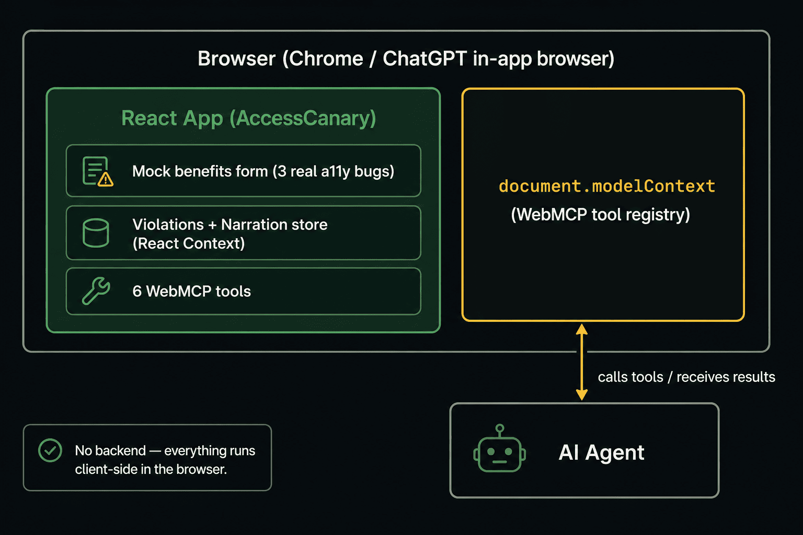
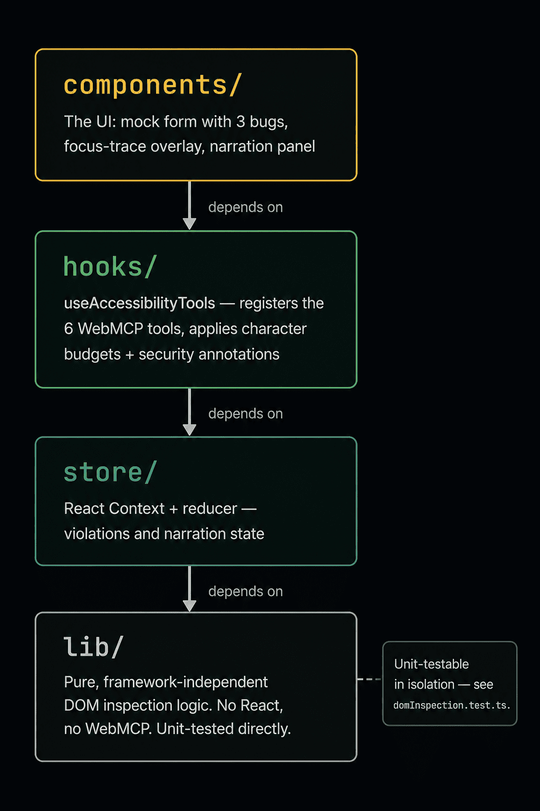
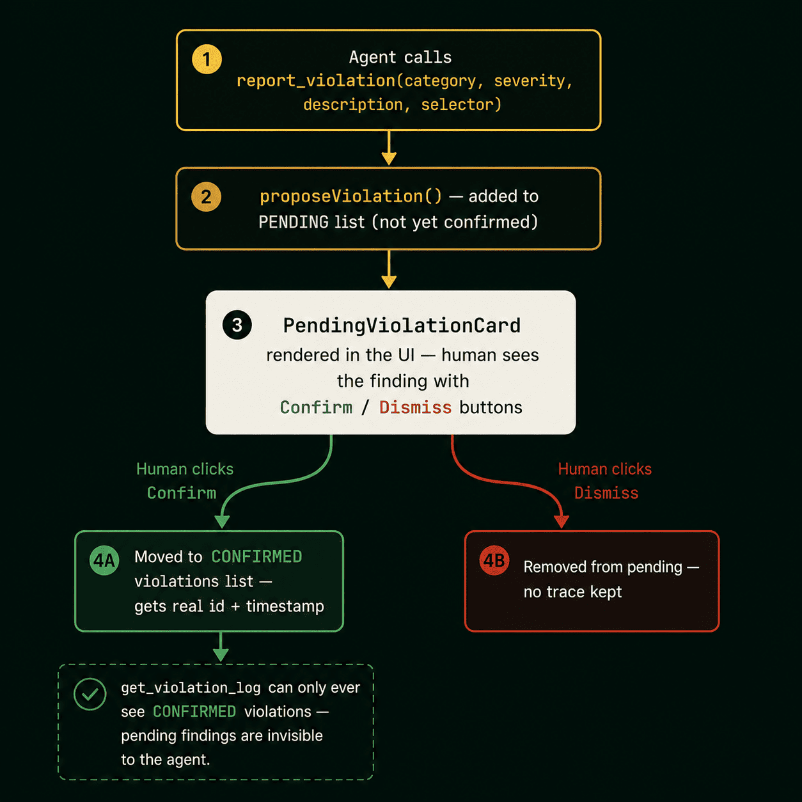
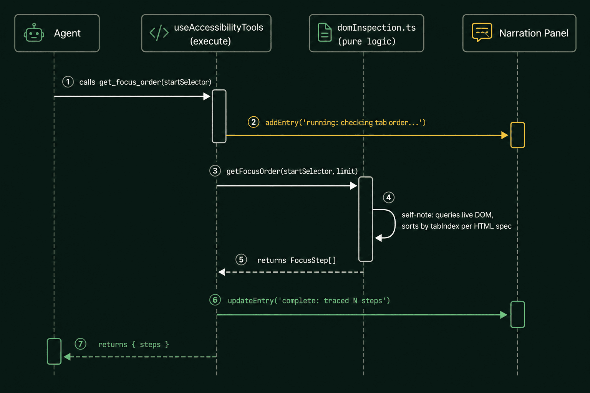
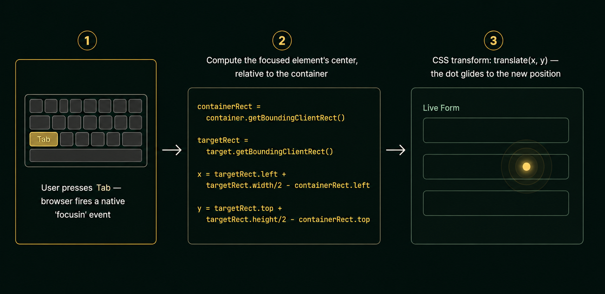

# Architecture

**Read this if:** you want to understand how AccessCanary is structured, how a WebMCP tool call flows from agent to DOM to UI, why the human-confirmation gate exists, or how the design decisions support a 30–40% coverage gap that automated scanners can't close.

## Table of Contents

- [System overview](#system-overview)
- [Layer structure](#layer-structure)
- [Data flow: a single tool call](#data-flow-a-single-tool-call-end-to-end)
- [Data flow: human-in-the-loop confirmation](#data-flow-the-human-in-the-loop-confirmation-cycle)
- [Why React Context instead of Redux/Zustand](#why-react-context-instead-of-reduxzustand)
- [Why JSON Schema instead of Zod](#why-json-schema-instead-of-zod-for-tool-schemas)
- [The focus-trace overlay](#the-focus-trace-overlays-mechanism)

## System overview



AccessCanary is a single-page React application with **zero backend.** Everything runs in the browser: the mock form, the six WebMCP tools, the violation store, and the narration feed. An AI agent—via ChatGPT's in-app browser or Chrome with WebMCP enabled—connects to `document.modelContext` and calls the tools directly. No server involvement.

## Layer structure

The codebase is organized into four layers, each with a single responsibility:

```
src/
├── lib/            Pure, framework-independent logic — no React, no WebMCP.
│                    Unit-tested directly. This is what actually inspects the DOM.
├── store/           React Context + reducer state — violations and narration feed.
│                    Deliberately NOT an external library (Redux/Zustand); React's
│                    own primitives are the right-sized tool at this scale.
├── hooks/           useAccessibilityTools — the WebMCP registration layer. Wires
│                    the pure lib/ functions to WebMCP tool definitions, applying
│                    character budgets and security annotations.
└── components/      The UI: the mock form with its 3 bugs, the focus-trace
                     overlay, and the narration panel.
```



This separation exists for concrete testability: `lib/domInspection.ts` and `lib/liveRegionTracker.ts` can run under Vitest + jsdom with zero WebMCP or React scaffolding. See [`docs/TESTING.md`](TESTING.md).

## Data flow: a single tool call, end to end



Here's what happens when an agent calls `get_focus_order`:

1. **Agent invokes the tool** via WebMCP client, passing `startSelector` through `document.modelContext`.
2. **`useAccessibilityTools` receives the call** inside React, with access to `useNarrationStore()`.
3. **A "running" narration entry posts immediately** — `addEntry('get_focus_order', 'Checking tab order from ...')` — so the panel shows activity the instant the call starts, not after it resolves.
4. **The pure logic layer does the actual work.** `getFocusOrder()` in `lib/domInspection.ts` collects all focusable elements, separates and sorts any with positive `tabIndex` (per the HTML spec), and returns the sequence from the requested element. This function has zero React/WebMCP knowledge—it's pure DOM + data.
5. **The result is reshaped for the tool boundary.** A mapper (`plainFocusStep`) converts typed domain objects into plain literals matching the JSON-Schema output type. (See [`docs/DEVELOPMENT.md`](DEVELOPMENT.md) for why this reshaping layer exists.)
6. **The narration entry resolves** — `updateEntry(entryId, { message: ..., status: 'complete' })` — with a human-readable summary.
7. **React re-renders the panel**, subscribed to the narration context, showing the new entry with its color-coded status dot.
8. **The tool returns structured result** back to the calling agent.

## Data flow: the human-in-the-loop confirmation cycle



This is AccessCanary's central mechanism: the one state-changing tool **does not** execute findings unilaterally:

1. Agent calls `report_violation` with category, severity, description, and selector.
2. `useAccessibilityTools` calls `proposeViolation()` on the violations store—which adds the finding to **pending**, NOT confirmed.
3. Tool returns `{ pendingId, status: 'awaiting_human_confirmation' }` — explicitly telling the agent: *not logged yet.*
4. `NarrationPanel` renders a `PendingViolationCard` with visible Confirm and Dismiss buttons.
5. **Only human confirmation** moves the finding from `pending` to the permanent `violations` array (assigning a real `id` and `timestamp`). Dismiss removes it entirely.
6. `get_violation_log` only ever sees the confirmed `violations` array—proposed-but-unconfirmed findings are invisible to it.

This is what "thoughtful WebMCP" means concretely: the state-changing tool is annotated `readOnlyHint: false`, but its actual effect is gated behind human decision, not direct execution.

## Why React Context instead of Redux/Zustand

Two small stores (`violationsStore` and `narrationStore`), each with 2–3 actions, on a single-page app with one user session. An external library adds dependency weight and boilerplate with no benefit at this scale. React's `useReducer` + `Context` is the right-sized tool. (See [`docs/DEVELOPMENT.md`](DEVELOPMENT.md) for the fuller reasoning, including why an earlier design with Zod-based schemas was reconsidered for the same "avoid unnecessary complexity/coupling" reason.)

## Why JSON Schema instead of Zod for tool schemas

Documented in full in [`docs/DEVELOPMENT.md`](DEVELOPMENT.md): the installed Zod version (v4) doesn't match what `@mcp-b/react-webmcp` expects internally (v3 shape), since Zod isn't a declared peer dependency. Plain JSON Schema has zero version-coupling risk and is the format the package's own official examples show first.

## The focus-trace overlay's mechanism



`FocusTraceOverlay` listens for the browser's native `focusin` event. On each event, it checks whether the focused element is inside the form container (via `containerRef`), and if so, computes the element's center point relative to the container using `getBoundingClientRect()`. That position is applied to a glowing dot via CSS `transform: translate()`, animated with a `transition`. The dot visibly glides to wherever focus is—including into broken states (the misordered submit button, the trapped date-picker)—making the underlying bug visible without narration text required.
