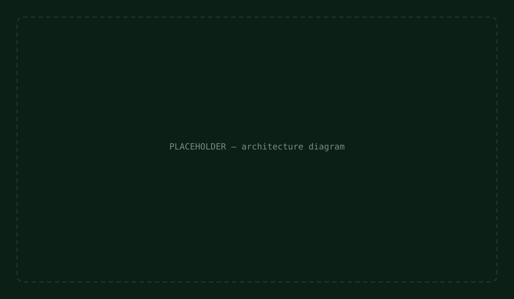

# Architecture

This document explains how AccessCanary is put together: the layer structure, how data
flows through a single tool call, and why each major structural decision was made.

## System overview



AccessCanary is a single-page React application with no backend. Everything — the mock
form, the WebMCP tools, the violation store, the narration feed — runs entirely in the
browser. An AI agent (via ChatGPT's in-app browser, or Chrome with the WebMCP flag
enabled) connects to the page's `document.modelContext` and calls the six registered
tools directly; there is no server-side component in this architecture at all.

## Layer structure

The codebase is organized into four layers, each with a single, clear responsibility:

```
src/
├── lib/            Pure, framework-independent logic — no React, no WebMCP.
│                    Unit-tested directly. This is what actually inspects the DOM.
├── store/           React Context + reducer state — violations and narration feed.
│                    Deliberately NOT an external library (Redux/Zustand); React's
│                    own primitives are the right-sized tool at this scale.
├── hooks/           useAccessibilityTools — the WebMCP registration layer. Wires
│                    the pure lib/ functions to WebMCP tool definitions, applying
│                    character budgets and security annotations.
└── components/      The UI: the mock form with its 3 bugs, the focus-trace
                     overlay, and the narration panel.
```


This separation exists for a concrete reason, not just tidiness: `lib/domInspection.ts`
and `lib/liveRegionTracker.ts` can be unit-tested with plain Vitest + jsdom, with zero
WebMCP or React test scaffolding required. See `docs/TESTING.md`.

## Data flow: a single tool call, end to end


Walking through what happens when an agent calls `get_focus_order`:

1. **Agent calls the tool.** The agent (via its WebMCP client) invokes
   `get_focus_order` with a `startSelector` argument, through
   `document.modelContext`.
2. **`useAccessibilityTools` receives the call.** The tool's `execute` function
   runs inside React, with access to the narration store via `useNarrationStore()`.
3. **A "running" narration entry is posted immediately** — `addEntry('get_focus_order',
   'Checking tab order from ...')` — so the panel shows activity the instant the call
   starts, not only once it resolves.
4. **The pure logic layer does the actual work.** `getFocusOrder()` in
   `lib/domInspection.ts` queries the live DOM: it collects all focusable elements,
   separates out any with a positive `tabIndex`, sorts those by tabIndex value (per the
   HTML spec), and returns the resulting sequence starting from the requested element.
   This function has no knowledge of React or WebMCP — it's pure DOM + data.
5. **The result is reshaped for the tool boundary.** A small mapper (`plainFocusStep`)
   converts the typed domain objects into plain object literals matching the tool's
   JSON-Schema-derived output type (see `docs/DEVELOPMENT.md` for why this reshaping step
   exists).
6. **The narration entry is resolved** — `updateEntry(entryId, { message: ..., status:
   'complete' })` — with a human-readable summary of what was found.
7. **React re-renders the narration panel**, which is subscribed to the narration
   context, showing the new feed entry with its color-coded status dot.
8. **The tool returns its structured result** back to the calling agent.

## Data flow: the human-in-the-loop confirmation cycle


This is the project's central mechanism, and it deliberately does **not** let the agent
log a finding unilaterally:

1. The agent calls `report_violation` with a category, severity, description, and
   selector.
2. Inside `useAccessibilityTools`, this calls `proposeViolation()` on the violations
   store — which generates a `pendingId` and adds the finding to a **pending** list, NOT
   the confirmed violations list.
3. The tool returns `{ pendingId, status: 'awaiting_human_confirmation' }` to the agent —
   the agent is explicitly told its finding has not been logged yet.
4. The `NarrationPanel` renders a `PendingViolationCard` for this finding, with visible
   Confirm and Dismiss buttons.
5. **Only a human clicking Confirm** moves the finding from `pending` into the permanent
   `violations` array (assigning a real `id` and `timestamp` at that point). Clicking
   Dismiss removes it from `pending` with no further trace.
6. `get_violation_log`, when later called by the agent, can only ever see the confirmed
   `violations` array — proposed-but-unconfirmed findings are invisible to it.

This is what "thoughtful use of WebMCP" means concretely in this project: the one
state-changing tool (`report_violation`) is explicitly annotated `readOnlyHint: false`,
and its actual effect is gated behind a human decision, not executed directly.

## Why React Context instead of Redux/Zustand

Two small stores (`violationsStore` and `narrationStore`), each with 2–3 actions, on a
single-page app with one active user session. An external state management library would
add a dependency and boilerplate with no corresponding benefit at this scale — React's
built-in `useReducer` + `Context` is the right-sized tool. See `docs/DEVELOPMENT.md` for
the fuller reasoning trail, including where an earlier design (Zod-based schemas) was
reconsidered for a similar "avoid unnecessary complexity/coupling" reason.

## Why JSON Schema instead of Zod for tool schemas

Documented in full in `docs/DEVELOPMENT.md` — in short, the installed Zod version (v4)
did not structurally match what `@mcp-b/react-webmcp`'s Zod-map overload expects
internally (the package has no declared Zod peer dependency), so plain JSON Schema was
used instead: zero version-coupling risk, and it's the format the package's own official
examples show first.

## The focus-trace overlay's mechanism


`FocusTraceOverlay` listens for the browser's native `focusin` event on `document`. On
each event, it checks whether the newly focused element is inside the theatre container
(via `containerRef`), and if so, computes the element's center point relative to the
container using `getBoundingClientRect()` on both. That position is applied to a small
dot via a CSS `transform: translate()`, animated with a `transition`, so the dot visibly
glides to wherever focus currently is — including into the broken states (the misordered
submit button, the trapped date-picker), making the underlying bug visible without any
narration text required.
